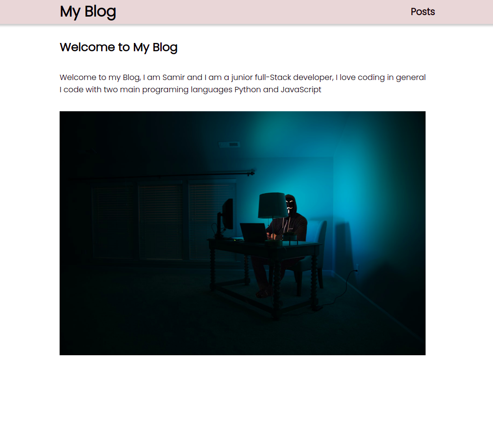

# My Blog

> A personal Full-stack Blog, allows the user to read all the blog and read a specific Blog

## Table of contents

- [General info](#general-info)
- [Screenshots](#screenshots)
- [Technologies](#technologies)
- [Setup](#setup)
- [Features](#features)
- [Status](#status)
- [Inspiration](#inspiration)
- [Contact](#contact)

## General info

> A simple full-stack Personal Blog , the objective is to learn to connect the Back-end with the Front-end.

## Screenshots



## Technologies

- Node 14.5.5
- Nodemon 2.0.7
- Express 4.17.1
- VSC code
- JavaScript
- Postman
- Heroku

## Setup

- `npm run start`

- `npm run dev`

## Code Examples

```js
import React from "react";
import { BrowserRouter, Switch, Route } from "react-router-dom";
import PostList from "./components/PostList";
import Post from "./components/Post";
import Home from "./components/Home";
import Navbar from "./components/Navbar";
import "./style.css";

class App extends React.Component {
  render() {
    return (
      <BrowserRouter>
        <Navbar />
        <Switch>
          <Route exact path="/" component={Home} />
          <Route path="/posts/:id" component={Post} />
          <Route path="/posts" component={PostList} />
        </Switch>
      </BrowserRouter>
    );
  }
}

export default App;
```

## Features

List of features ready and Todos for future development

-
-
-

To-do list:

-
-

## Status

Project is: _in progress_

## Inspiration

Creating a blog with the MERN stack [Devistry]

## Contact

By [HYF - Group 3]
